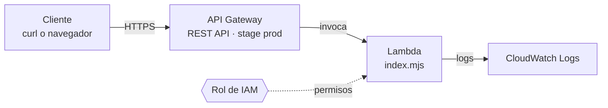

# aws-coderhouse

Repositorio con mis entregas del curso **Cloud Computing (AWS)** de [Coderhouse](https://www.coderhouse.com/). Cada entrega es un ejercicio práctico del curso, resuelto con infraestructura como código usando **AWS CDK** (JavaScript).

## 📚 Índice de entregas

1. [**AWS Lambda: Introducción al cómputo serverless**](#-entrega-1--aws-lambda-introducción-al-cómputo-serverless) · Escenario B (API Gateway) · 🚧 en curso

## 🔀 Cómo está organizado el repositorio

- **`main`:** solo tiene entregas terminadas y revisadas.
- **Una rama por entrega:** cada ejercicio se desarrolla en su propia rama, con el nombre `entrega/NN-tema`. Por ejemplo, `entrega/01-lambda-serverless`.
- **Un Pull Request por entrega:** al terminar, se abre un PR hacia `main` con el título de la entrega, y se mergea. Así el historial queda ordenado y cada entrega se puede revisar por separado.
- **Este índice:** al mergear una entrega se agrega una línea acá con su título y su estado.

---

## 🚀 Entrega 1 · AWS Lambda: Introducción al cómputo serverless

**Escenario B (API):** una función Lambda que se dispara vía **API Gateway** y responde con el mensaje `Hola, mundo desde Lambda`.

**Objetivo del ejercicio:** pasar de la teoría a la práctica con una arquitectura básica *event-driven*, donde una acción en la nube (una petición HTTP) dispara automáticamente mi código, usando los permisos de seguridad de IAM. La infraestructura se define con AWS CDK en lugar de crearla a mano desde la consola.

### 🧭 Qué hace

1. Un cliente hace una petición HTTP a la URL de la API.
2. **API Gateway** recibe la petición y la reenvía a la función.
3. **Lambda** ejecuta `lambda/index.mjs`, registra la ruta pedida en los logs y responde `200` con el texto `Hola, mundo desde Lambda`.
4. Los logs de cada ejecución quedan en **CloudWatch Logs**.



### 📁 Estructura

- **`lambda/index.mjs`:** el código de la función (Node.js).
- **`lib/aws-coderhouse-stack.js`:** el stack de CDK con la función, la API y sus permisos.
- **`bin/aws-coderhouse.js`:** el punto de entrada de la app de CDK.
- **`test/`:** carpeta de pruebas de CDK.
- **`iam_policy.json`:** la política de permisos de la entrega (se agrega después del despliegue).
- **`capturas/`:** evidencia de la ejecución (se agrega después del despliegue).

### 🔐 Permisos de IAM

Para este escenario hacen falta dos permisos, y CDK crea ambos:

- **Rol de ejecución de la función:** un rol de servicio que asume Lambda, con la política administrada `AWSLambdaBasicExecutionRole`. Permite escribir logs en CloudWatch. Sin ella no aparecería ningún log.
- **Permiso de invocación:** una política *basada en recurso* sobre la función, con `lambda:InvokeFunction` y principal `apigateway.amazonaws.com`. Es lo que autoriza a API Gateway a invocar la función. Sin esto, la API respondería con error.

En este escenario la función no accede a otros servicios, por eso no lleva política inline propia (como sí ocurriría con `s3:GetObject` en el escenario de S3).

### 🛠️ Cómo desplegarlo

**Requisitos:** Node.js, AWS CLI y credenciales de una cuenta de AWS con permisos para crear funciones Lambda, APIs, roles de IAM y grupos de logs.

```bash
npm install
```

Comprobar que todo compila. Es local y no toca AWS:

```bash
npx aws-cdk synth
```

Confirmar con qué cuenta se va a desplegar, antes de crear nada:

```bash
aws sts get-caller-identity
```

Ver qué se va a crear y desplegar:

```bash
npx aws-cdk diff
```

```bash
npx aws-cdk deploy
```

Si la cuenta y la región nunca se usaron con CDK, hace falta ejecutar una vez `npx aws-cdk bootstrap` antes del `deploy`.

Al terminar, CDK imprime la URL de la API (`ApiSaludoEndpoint...`). Para probarla:

```bash
curl URL_DE_LA_API
```

Para ver los logs de la función en CloudWatch, desde la consola: función Lambda → pestaña **Monitor** → **View CloudWatch logs**.

### 📸 Evidencia

> Las capturas se agregan en `capturas/` después del despliegue.

- Respuesta de la API con `curl` (`Hola, mundo desde Lambda`): pendiente
- Rol de IAM con `AWSLambdaBasicExecutionRole`: pendiente
- Función con el trigger de API Gateway en la consola: pendiente
- Log de la ejecución en CloudWatch: pendiente

### ⚠️ Errores comunes que se tuvieron en cuenta

- **Formato de la respuesta:** API Gateway espera un objeto con `statusCode` y `body` (este último como texto). Si la función devuelve otra cosa, la API responde `502 Internal server error`. La función devuelve exactamente esa estructura.
- **Timeout:** una función nueva trae 3 segundos por defecto. Acá se configuró en 10, más que suficiente para un saludo.
- **Módulos ES:** el archivo se llama `index.mjs` porque usa `export`. Con la extensión `.js`, Lambda lo tomaría como CommonJS y fallaría.

### 🧹 Limpieza

La API queda pública, sin autenticación. Al terminar de sacar las capturas, conviene borrar todo:

```bash
npx aws-cdk destroy
```

---

## ℹ️ Sobre este repositorio

Es material de estudio y práctica del curso. Las cuentas de AWS, credenciales e identificadores propios no se incluyen en el repositorio.
